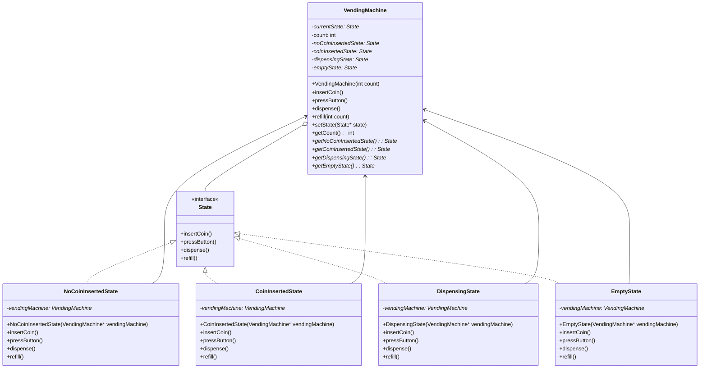

# Vending Machine using State Design Pattern

This project implements a simple vending machine using the State design pattern in C++.

## State Design Pattern

The State pattern is a behavioral design pattern that allows an object to alter its behavior when its internal state changes. The object appears to change its class.

The pattern consists of the following components:
-   **Context**: This is the class that has a state. In our example, `VendingMachine` is the context.
-   **State**: This is an interface that encapsulates the behavior associated with a particular state of the context. In our example, `State` is the state interface.
-   **Concrete States**: These are the classes that implement the `State` interface. Each concrete state implements a behavior associated with a state of the context. In our example, `NoCoinInsertedState`, `CoinInsertedState`, `DispensingState`, and `EmptyState` are the concrete states.

## UML Diagram



## How to Compile and Run

You can compile the code using a C++ compiler like g++.

```bash
g++ main.cpp vending_machine.cpp no_coin_inserted_state.cpp coin_inserted_state.cpp dispensing_state.cpp empty_state.cpp -o vending_machine
./vending_machine
```
